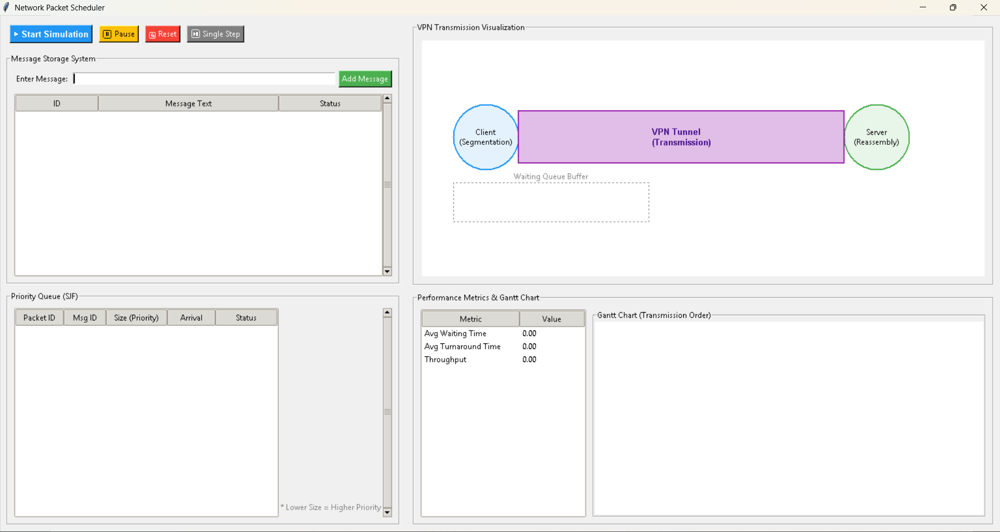
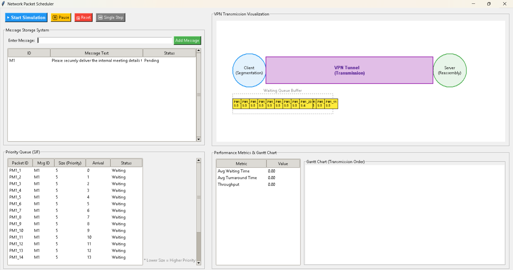
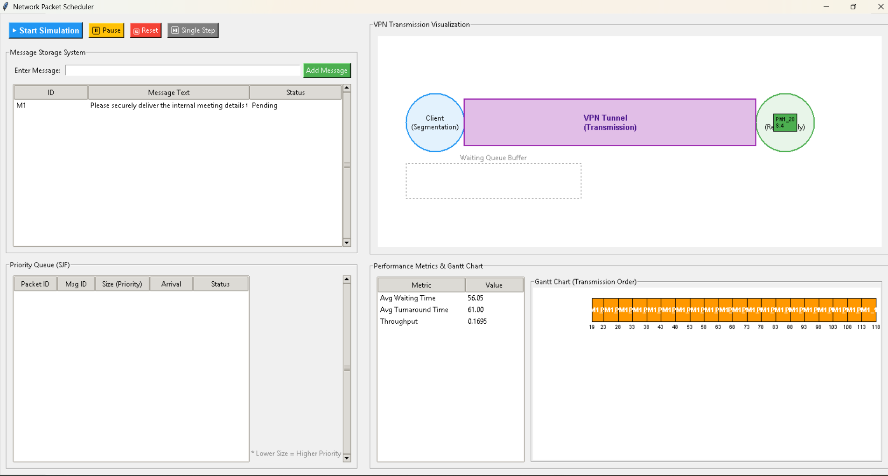

# Network Packet Scheduler using Priority Queue (SJF)

## Overview

In this project, the idea of implementing the process of transmission of packets in a network through the use of a Priority Queue algorithm similar to the SJF algorithm is realized in a simulated environment.

How a message sent from a client can be divided into several packets, placed into a transmission queue based on their sizes, and transmitted through a simulated tunnel like a Virtual Private Network (VPN) is shown in the project.

Visualization of packet scheduling is the main aim of this project.

---

## Features

- Message input through a Tkinter-based GUI
- Automatic segmentation of messages into multiple packets
- Packet queue management using Priority Queue
- SJF-based scheduling logic:
  - Smaller packet size = higher priority
- Visualization of:
  - Client-side segmentation
  - Waiting queue buffer
  - Packet transmission flow
  - Server-side reassembly
- Gantt Chart representation of packet transmission order
- Performance metrics calculation:
  - Average Waiting Time
  - Average Turnaround Time
  - Throughput
- CSV-based storage for:
  - Message information
  - Packet details and transmission status
- Modular project structure separating:
  - GUI
  - Scheduling logic
  - Packet models
  - Segmentation
  - Reassembly
  - Metrics calculation

---

## Concepts Used

### Data Structures
- Priority Queue

### Operating System Concepts
- Shortest Job First (SJF) Scheduling
- Waiting Queue Management
- Turnaround Time
- Throughput Analysis

### Networking Concepts
- Packet Segmentation
- Packet Transmission
- Queue Buffering
- Packet Reassembly

### Software Design
- Modular Architecture
- Separation of Concerns

---

## Architecture

```text
User Message Input
        ↓
Message Segmentation
        ↓
Packet Creation
        ↓
Priority Queue (SJF Scheduling)
        ↓
Waiting Queue Buffer
        ↓
VPN-like Transmission Simulation
        ↓
Server-side Packet Reassembly
        ↓
Performance Metrics & Gantt Chart
```

### Project Structure

```text
network_packet_scheduler/
│
├── animation/        # Packet movement and visualization
├── data/             # CSV storage for messages and packets
├── gui/              # Tkinter GUI components
├── models/           # Message and packet models
├── scheduler/        # Priority Queue and SJF logic
├── segmentation/     # Message-to-packet segmentation
├── server/           # Packet reassembly logic
├── storage/          # Data persistence handling
├── utils/            # Helper utilities and constants
│
├── main.py
├── requirements.txt
├── README.md
│
├── test_scheduler.py
├── test_segmentation.py
└── test_reassembly.py
```

---

## Screenshots

### Main Interface



### Packet Segmentation and Queue


### Transmission Visualization and Metrics


---

## How to Run

### 1. Clone the Repository

```bash
git clone https://github.com/your-username/network-packet-scheduler.git
cd network-packet-scheduler
```

### 2. Install Dependencies

```bash
pip install -r requirements.txt
```

### 3. Run the Application

```bash
python main.py
```

---

## Limitations

- This project is a simulation and does not implement real VPN protocols.
- Actual encryption, authentication, and secure socket communication are not implemented.
- Packet transmission is visualized logically and not sent through real network sockets.
- The scheduling model is simplified for educational demonstration purposes.
- The project primarily focuses on Priority Queue and SJF scheduling behavior rather than real-world network security implementation.

---

## Purpose of the Project

The objective of this project is to demonstrate how Priority Queue scheduling can be applied to network packet handling scenarios using SJF principles, while also visualizing packet flow, transmission order, and scheduling performance metrics in an interactive manner.